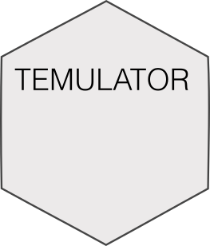

# TEMULATOR 
<!-- badges: start -->
[](https://github.com/T-Heide/TEMULATOR/actions)
[](https://codecov.io/gh/T-Heide/TEMULATOR)
<!-- badges: end -->

A small R package to generate synthetic tumour sequencing data.

-----

#### Installation

``` r
# install.packages("devtools")
devtools::install_github("T-Heide/TEMULATOR")
```
-----

#### Help and support

[](https://t-heide.github.io/TEMULATOR/)

-----

#### Copyright and contacts

Timon Heide, _Institute of Cancer Research, London, UK_.

[](mailto:timon.heide@icr.ac.uk)
[](https://github.com/T-Heide)
